# 📘 Application Blueprint
## Catering Management System v1.6.2

---

## Table of Contents
1. [System Overview](#1-system-overview)
2. [Architecture](#2-architecture)
3. [User Roles & Flows](#3-user-roles--flows)
4. [Feature Catalog](#4-feature-catalog)
5. [Database Schema](#5-database-schema)
6. [API Structure](#6-api-structure)
7. [Key Business Logic](#7-key-business-logic)
8. [Deployment Architecture](#8-deployment-architecture)

---

## 1. System Overview

### Purpose
Enterprise food catering management system for handling meal orders, check-ins, blacklist management, and reporting for corporate employees.

### Tech Stack

| Layer | Technology |
|-------|------------|
| Frontend | React 18 + TypeScript + Vite |
| Backend | Node.js + Express + TypeScript |
| Database | PostgreSQL |
| Cache | Redis |
| Process Manager | PM2 (Cluster Mode) |
| Deployment | Docker + Docker Compose |

### System Capacity
- **Target Users**: 2,500+ employees
- **Concurrent Connections**: 50 database connections
- **Real-time**: Server-Sent Events (SSE)

---

## 2. Architecture

### High-Level Architecture

```mermaid
flowchart TB
    subgraph Client["Client Layer"]
        WEB["🖥️ Web Browser"]
        MOBILE["📱 Responsive UI"]
    end
    
    subgraph LB["Load Balancer"]
        NPM["Nginx Proxy Manager<br/>SSL/HTTPS"]
    end
    
    subgraph APP["Application Layer"]
        FE["📱 Frontend<br/>React:3011"]
        BE["⚙️ Backend<br/>Express:3012"]
    end
    
    subgraph CACHE["Cache Layer"]
        REDIS["📦 Redis<br/>:6379"]
    end
    
    subgraph DATA["Data Layer"]
        DB[("🗄️ PostgreSQL<br/>:5432")]
    end
    
    WEB --> NPM
    MOBILE --> NPM
    NPM --> FE
    NPM --> BE
    FE --> BE
    BE --> REDIS
    BE --> DB
```



### Backend Component Architecture


---

## 3. User Roles & Flows

### Role Hierarchy

| Role | Access Level | Description |
|------|-------------|-------------|
| **ADMIN** | Full | System administrator, all features |
| **CANTEEN** | Check-in | Canteen staff, check-in operations |
| **VENDOR** | Menu | Food vendor, menu management |
| **USER** | Basic | Employee, order meals |

### User Order Flow

```mermaid
flowchart TD
    A[Login] --> B{Role?}
    B -->|USER| C[View Menu]
    C --> D{Holiday?}
    D -->|Yes| E[Show Blocked]
    D -->|No| F{Cutoff OK?}
    F -->|No| G[Show Cutoff Message]
    F -->|Yes| H[Select Shift]
    H --> I[Select Canteen]
    I --> J[Create Order]
    J --> K[Generate QR Code]
    K --> L[Show Confirmation]
    
    L --> M{At Canteen?}
    M -->|Yes| N[Scan QR / Manual Check-in]
    N --> O{Before Cutoff?}
    O -->|Yes| P[✅ PICKED_UP]
    O -->|No| Q[❌ NO_SHOW]
    
    Q --> R{3 Strikes?}
    R -->|Yes| S[🚫 BLACKLISTED]
    R -->|No| T[Strike +1]
```



### Admin Dashboard Flow


---

## 4. Feature Catalog

### User Features

| Feature | Description | Page |
|---------|-------------|------|
| Order Meal | Create meal orders for available shifts | OrderPage |
| View History | See order history with status | HistoryPage |
| Cancel Order | Cancel before cutoff time | OrderPage |
| Complaint | Submit food quality complaints | OrderPage |
| View Menu | Preview weekly food menu | FoodMenuPage |
| Profile | Update password, preferences | SettingsPage |

### Admin Features

| Feature | Description | Page |
|---------|-------------|------|
| Dashboard | Statistics, charts, realtime data | DashboardPage |
| Order List | View/manage all orders | OrderListPage |
| User Management | CRUD users, import Excel | UserManagementPage |
| Blacklist | Manage blacklisted users | BlacklistPage |
| Shift Config | Configure shifts, cutoff times | ShiftConfigPage |
| Holiday Calendar | Set holidays, blocked dates | CalendarPage |
| Company Structure | Manage company/division/dept | CompanyManagementPage |
| Canteen Setup | Configure canteen locations | CanteenManagementPage |
| Cost Analysis | Meal cost reports, trends | CostAnalysisPage |
| Messages | View complaints/cancellation reasons | MessagesPage |
| Announcements | Create user announcements | AnnouncementPage |
| Audit Log | Track all user actions | AuditLogPage |
| Export | Export data to Excel | ExportPage |
| Email Settings | SMTP configuration | EmailSettingsPage |
| Time Settings | NTP configuration | TimeSettingsPage |
| Backup/Restore | Database backup management | BackupRestorePage |
| System Update | Update application | UpdatePage |
| Uptime History | Server uptime monitoring | UptimeHistoryPage |
| Vendor Management | Manage food vendors | VendorManagementPage |
| Menu Items | Manage menu catalog | MenuItemsPage |
| Weekly Menu | Plan weekly menus | WeeklyMenuPage |

### Canteen Staff Features

| Feature | Description | Page |
|---------|-------------|------|
| Check-in Station | QR scan or manual lookup | CheckInPage |
| Pick-up Stats | Today's pick-up statistics | PickupStatsPage |

### Vendor Features

| Feature | Description | Page |
|---------|-------------|------|
| Dashboard | Vendor order statistics | VendorDashboardPage |
| Pick-up Stats | Vendor-specific stats | VendorPickupStatsPage |

---

## 5. Database Schema

### Entity Relationship Diagram


### Core Models

| Model | Purpose | Key Fields |
|-------|---------|------------|
| **Company** | Top-level organization | name, isActive |
| **Division** | Company division | name, companyId |
| **Department** | Work department | name, divisionId, workDays |
| **User** | System user | externalId, name, role, noShowCount |
| **Shift** | Meal shift | name, startTime, endTime, mealPrice |
| **Order** | Meal order | userId, shiftId, orderDate, status, qrCode |
| **Canteen** | Pickup location | name, location, capacity |
| **Blacklist** | No-show penalties | userId, reason, startDate, endDate |
| **Holiday** | Blocked dates | date, name, shiftId |
| **Settings** | System config | cutoffMode, cutoffHours, blacklistStrikes |
| **AuditLog** | Activity tracking | action, entity, userId, timestamp |
| **Vendor** | Food supplier | name, contact |
| **MenuItem** | Menu catalog | name, category, vendorId |
| **WeeklyMenu** | Weekly meal plan | weekNumber, dayOfWeek, menuItemId |

### Order Status Flow


---

## 6. API Structure

### API Endpoint Categories

| Base Path | Purpose | Auth Required |
|-----------|---------|---------------|
| `/api/auth` | Authentication | No (login) |
| `/api/users` | User management | Yes (ADMIN) |
| `/api/orders` | Order operations | Yes |
| `/api/shifts` | Shift management | Yes |
| `/api/settings` | System settings | Yes (ADMIN) |
| `/api/companies` | Org structure | Yes (ADMIN) |
| `/api/holidays` | Holiday management | Yes (ADMIN) |
| `/api/canteens` | Canteen management | Yes |
| `/api/blacklist` | Blacklist management | Yes (ADMIN) |
| `/api/server` | System operations | Yes (ADMIN) |
| `/api/messages` | User messages | Yes |
| `/api/announcements` | Announcements | Yes |
| `/api/vendors` | Vendor management | Yes (ADMIN) |
| `/api/menu-items` | Menu items | Yes |
| `/api/weekly-menu` | Menu planning | Yes |
| `/api/sse` | Real-time events | Yes |

### Key Endpoints

```
POST   /api/auth/login           - User login
POST   /api/auth/change-password - Password change

GET    /api/orders/my-orders     - User's orders
POST   /api/orders               - Create order
POST   /api/orders/bulk          - Bulk order
POST   /api/orders/checkin/qr    - QR check-in
POST   /api/orders/checkin/manual- Manual check-in
POST   /api/orders/:id/cancel    - Cancel order

GET    /api/orders/stats/dashboard    - Dashboard stats
GET    /api/orders/export             - Export to Excel

GET    /api/server/pm2-status         - PM2 cluster info
GET    /api/server/performance        - System metrics
POST   /api/server/backup             - Create backup
POST   /api/server/restore/:id        - Restore backup
```

---

## 7. Key Business Logic

### Cutoff Time Logic

```mermaid
flowchart TD
    A[User Attempts Order] --> B{Cutoff Mode?}
    
    B -->|Per-Shift| C[Calculate: ShiftStart - cutoffDays - cutoffHours]
    B -->|Weekly| D[Check: Passed weeklyCutoffDay + weeklyCutoffHour?]
    
    C --> E{CurrentTime < CutoffTime?}
    D --> F{Within Order Window?}
    
    E -->|Yes| G[✅ Allow Order]
    E -->|No| H[❌ Block: Past Cutoff]
    
    F -->|Yes| G
    F -->|No| H
```



### No-Show Processing (Hourly Cron)


### Check-in Process

```mermaid
flowchart TD
    A[Scan QR / Enter ID] --> B{Order Exists?}
    
    B -->|No| C[❌ Error: Not Found]
    B -->|Yes| D{Status == ORDERED?}
    
    D -->|No| E[❌ Error: Already Processed]
    D -->|Yes| F{User Blacklisted?}
    
    F -->|Yes| G[❌ Error: User Blacklisted]
    F -->|No| H{Within Check-in Window?}
    
    H -->|No| I[❌ Error: Too Early/Late]
    H -->|Yes| J[✅ Update: PICKED_UP]
    
    J --> K[Record checkInTime]
    K --> L[Record checkedInBy]
    L --> M[Broadcast SSE Event]
```



---

## 8. Deployment Architecture

### Docker Compose Stack


### Container Configuration

| Container | Image | Port | Volume |
|-----------|-------|------|--------|
| catering-db | postgres:15-alpine | 5432 | pgdata |
| catering-redis | redis:7-alpine | 6379 | - |
| catering-backend | node:20-alpine + PM2 | 3012 | uploads, backups |
| catering-frontend | node:20-alpine | 3011 | - |
| nginx-proxy-manager | jc21/nginx-proxy-manager | 80, 443, 81 | npm-data |

### PM2 Cluster Configuration

```javascript
{
  name: 'catering-backend',
  script: 'dist/index.js',
  instances: 'max',        // All CPU cores
  exec_mode: 'cluster',
  max_memory_restart: '500M',
  autorestart: true
}
```

---

## Quick Reference

### Environment Variables

| Variable | Description | Default |
|----------|-------------|---------|
| `PORT` | Backend port | 3012 |
| `DATABASE_URL` | PostgreSQL connection | - |
| `REDIS_URL` | Redis connection | redis://catering-redis:6379 |
| `JWT_SECRET` | JWT signing secret | - |
| `CORS_ORIGIN` | Frontend URL | http://localhost:3011 |
| `NODE_ENV` | Environment | development |

### Useful Commands

```bash
# Development
npm run dev                 # Start with nodemon

# Production
npm run build              # Build TypeScript
npm run pm2:start          # Start PM2 cluster

# Database
npx prisma db push         # Sync schema
npx prisma studio          # GUI for database

# Docker
docker compose up -d       # Start all containers
docker compose logs -f     # View logs
./update.sh                # Update application
```

---

*Document Version: 1.6.2*  
*Last Updated: 2026-01-11*
