# Deploy Catering Management System ke Linux dengan Nginx Proxy Manager

Panduan lengkap untuk deploy aplikasi dengan Nginx Proxy Manager (NPM) sebagai reverse proxy.

---

## Daftar Isi
1. [Arsitektur](#arsitektur)
2. [Migrasi dari Nginx Bawaan](#migrasi-dari-nginx-bawaan-ke-npm)
3. [Fresh Install](#fresh-install-instalasi-baru)
4. [Install NPM](#step-0-install-nginx-proxy-manager)
5. [Konfigurasi NPM](#step-7-konfigurasi-nginx-proxy-manager)

---

## Arsitektur

```mermaid
flowchart TB
    subgraph Internet
        USER[👤 User Browser]
    end
    
    subgraph Server["🖥️ Linux Server"]
        subgraph NPM["Nginx Proxy Manager :80/:443"]
            HTTPS[HTTPS/SSL Termination]
        end
        
        subgraph Docker["Docker Network: catering-network"]
            FE["📱 Frontend\n:3011"]
            BE["⚙️ Backend\n:3012"]
            DB[("🗄️ PostgreSQL\n:5432")]
            REDIS["📦 Redis\n:6379"]
            UPLOADS["📁 /uploads"]
        end
    end
    
    USER -->|https://domain.com| HTTPS
    HTTPS -->|"/ (root)"| FE
    HTTPS -->|"/api/*"| BE
    HTTPS -->|"/api/sse"| BE
    HTTPS -->|"/uploads/*"| UPLOADS
    
    FE -->|API calls| BE
    BE --> DB
    BE --> REDIS
    BE --> UPLOADS
```



### Routing Table

| Request Path | Forward To | Port | Keterangan |
|--------------|------------|------|------------|
| `/` | catering-frontend | 3011 | React SPA |
| `/api/*` | catering-backend | 3012 | REST API |
| `/api/sse` | catering-backend | 3012 | Server-Sent Events |
| `/uploads/*` | catering-backend | 3012 | Static files |

---

## Migrasi dari Nginx Bawaan ke NPM

Jika server Anda **sudah ada deployment sebelumnya** menggunakan nginx bawaan:

```bash
# 1. Masuk ke folder project
cd ~/Documents/Catering-Management-System

# 2. Stop containers lama
docker compose down

# 3. Pull update terbaru
git pull origin main

# 4. Backup docker-compose lama
cp docker-compose.yml docker-compose.yml.backup

# 5. Ganti ke NPM version
cp docker-compose.npm.yml docker-compose.yml

# 6. Update environment
nano .env
# Edit: CORS_ORIGIN=https://yourdomain.com

# 7. Start dengan config baru
docker compose up -d
```

> ⚠️ Data database **tidak akan hilang**.

**Rollback:**
```bash
docker compose down
cp docker-compose.yml.backup docker-compose.yml
docker compose up -d
```

> ✅ **Setelah migrasi selesai:**
> 1. Jika belum ada NPM → lanjut ke [STEP 0: Install NPM](#step-0-install-nginx-proxy-manager)
> 2. Jika NPM sudah ada → langsung ke [STEP 7: Konfigurasi NPM](#step-7-konfigurasi-nginx-proxy-manager)

---

## Fresh Install (Instalasi Baru)

### Persyaratan
- Ubuntu 20.04+ / Debian 11+
- RAM minimal 2GB
- Docker & Docker Compose

---

## STEP 0: Install Nginx Proxy Manager

```bash
# Buat folder NPM
mkdir -p ~/npm && cd ~/npm

# Buat docker-compose.yml untuk NPM
cat > docker-compose.yml << 'EOF'
version: '3.8'
services:
  npm:
    image: 'jc21/nginx-proxy-manager:latest'
    container_name: nginx-proxy-manager
    restart: unless-stopped
    ports:
      - '80:80'
      - '81:81'
      - '443:443'
    volumes:
      - ./data:/data
      - ./letsencrypt:/etc/letsencrypt
    networks:
      - catering-network

networks:
  catering-network:
    external: true
    name: cateringmanagement_catering-network
EOF

# Start NPM
docker compose up -d

# Tunggu 30 detik
sleep 30

# Verify
docker ps | grep nginx-proxy-manager
```

> ⚠️ **PENTING:** NPM harus join network yang sama dengan Catering Management agar bisa resolve nama container seperti `catering-backend` dan `catering-frontend`.
> 
> Jika network name berbeda, cek dengan: `docker network ls | grep catering`

**Akses NPM Admin:**
```
http://YOUR_SERVER_IP:81
```

**Login default:**
| Field | Value |
|-------|-------|
| Email | `admin@example.com` |
| Password | `changeme` |

> ⚠️ Ganti password setelah login pertama!

---

## STEP 1: Install Docker (Skip jika sudah ada)

```bash
# Update system
sudo apt update && sudo apt upgrade -y

# Install Docker
curl -fsSL https://get.docker.com | sudo sh

# Add user ke docker group
sudo usermod -aG docker $USER

# Logout dan login ulang
exit
```

---

## STEP 2: Clone Project

```bash
cd ~/Documents
git clone https://github.com/torpedoliar/Catering-Management-System.git
cd Catering-Management-System
```

---

## STEP 3: Setup Environment

```bash
cat > .env << 'EOF'
DB_PASSWORD=GantiDenganPasswordAman123
JWT_SECRET=GantiDenganSecretPanjangMinimal64Karakter1234567890ABCDEF
CORS_ORIGIN=https://catering.yourdomain.com
VITE_API_URL=
EOF

chmod 600 .env
```

> ⚠️ Ganti `catering.yourdomain.com` dengan domain Anda!

---

## STEP 4: Setup Docker Compose

```bash
cp docker-compose.npm.yml docker-compose.yml
```

---

## STEP 5: Build dan Start

```bash
docker compose build
docker compose up -d
sleep 15
docker compose ps
```

---

## STEP 6: Setup Database

```bash
# Sync schema
docker compose exec backend npx prisma db push --accept-data-loss

# Seed admin
docker compose exec backend node -e "
const { PrismaClient } = require('@prisma/client');
const bcrypt = require('bcryptjs');
const prisma = new PrismaClient();
async function seed() {
    const existing = await prisma.user.findUnique({ where: { externalId: 'ADMIN001' } });
    if (existing) {
        console.log('Admin already exists');
        return;
    }
    const hash = await bcrypt.hash('admin123', 10);
    await prisma.user.create({
        data: {
            externalId: 'ADMIN001',
            name: 'Administrator',
            password: hash,
            role: 'ADMIN',
            isActive: true,
            mustChangePassword: false,
            company: 'System',
            division: 'IT',
            department: 'Administration'
        }
    });
    console.log('Admin created: ADMIN001');
    await prisma.\$disconnect();
}
seed().catch(console.error);
"
```

---

## STEP 7: Konfigurasi Nginx Proxy Manager

### 7.1 Cek IP Container

```bash
docker inspect catering-frontend | grep IPAddress
docker inspect catering-backend | grep IPAddress
```

Catat IP-nya (contoh: `172.18.0.5` dan `172.18.0.4`)

### 7.2 Login NPM
Buka: `http://YOUR_SERVER_IP:81`

### 7.3 Buat Proxy Host

Klik **"Add Proxy Host"**

#### Tab "Details"
| Field | Value |
|-------|-------|
| Domain Names | `catering.yourdomain.com` |
| Scheme | `http` |
| Forward Hostname/IP | `catering-frontend` atau `172.18.0.X` |
| Forward Port | `3011` |
| Block Common Exploits | ✓ |
| Websockets Support | ✓ |

> 💡 Gunakan nama container `catering-frontend` atau IP address dari hasil `docker inspect`

### 7.4 Konfigurasi Routing API

> ⚠️ **PENTING:** Pilih **SALAH SATU** metode di bawah, jangan keduanya!

---

#### OPSI A: Gunakan Custom Locations (Recommended - Lebih Mudah)

Klik **"Add Location"** 3 kali:

**Location 1 - SSE:**
| Field | Value |
|-------|-------|
| Location | `/api/sse` |
| Scheme | `http` |
| Forward Hostname/IP | `catering-backend` atau `172.18.0.X` |
| Forward Port | `3012` |

Klik ⚙️ (gear) → Centang **Websockets Support**

**Location 2 - API:**
| Field | Value |
|-------|-------|
| Location | `/api` |
| Scheme | `http` |
| Forward Hostname/IP | `catering-backend` atau `172.18.0.X` |
| Forward Port | `3012` |

**Location 3 - Uploads:**
| Field | Value |
|-------|-------|
| Location | `/uploads` |
| Scheme | `http` |
| Forward Hostname/IP | `catering-backend` atau `172.18.0.X` |
| Forward Port | `3012` |

Klik **Save** → Selesai! Lanjut ke **7.5 SSL**.

---

#### OPSI B: Gunakan Advanced Config (Untuk konfigurasi lebih lengkap)

> ⚠️ **Jika menggunakan opsi ini, JANGAN buat Custom Locations di atas!**

1. Kosongkan tab **Custom Locations**
2. Pergi ke tab dengan ikon ⚙️ (gear) di kanan atas
3. Paste konfigurasi ini di **Custom Nginx Configuration**:

```nginx
# SSE Support - WAJIB untuk realtime
location /api/sse {
    proxy_pass http://catering-backend:3012;
    proxy_http_version 1.1;
    proxy_buffering off;
    proxy_cache off;
    proxy_read_timeout 86400;
    proxy_set_header Connection '';
    proxy_set_header Host $host;
    proxy_set_header X-Real-IP $remote_addr;
    chunked_transfer_encoding off;
}

# API dengan upload support
location /api/ {
    proxy_pass http://catering-backend:3012;
    proxy_http_version 1.1;
    proxy_set_header Host $host;
    proxy_set_header X-Real-IP $remote_addr;
    client_max_body_size 50M;
    proxy_read_timeout 300;
}

# Static uploads
location /uploads/ {
    proxy_pass http://catering-backend:3012/uploads/;
    expires 1d;
    add_header Cache-Control "public, immutable";
}
```

Klik **Save**.

---

### 7.6 Tab "SSL" (Recommended)

| Setting | Value |
|---------|-------|
| SSL Certificate | Request new SSL Certificate |
| Force SSL | ✓ |
| HTTP/2 Support | ✓ |
| Email for Let's Encrypt | your@email.com |

Klik **Save**

---

## STEP 8: Verifikasi

```bash
# Test health
curl -s http://localhost:3012/api/health

# Test via domain (ganti dengan domain Anda)
curl -s https://catering.yourdomain.com/api/health
```

---

## STEP 9: Akses Aplikasi

```
https://catering.yourdomain.com
```

**Login:**
- Username: `ADMIN001`
- Password: `admin123`

---

## Commands Berguna

```bash
# Lihat logs
docker compose logs -f

# Restart
docker compose restart backend

# Update aplikasi
git pull origin main
docker compose up -d --build

# Stop semua
docker compose down
```

---

## Troubleshooting

### SSE tidak connect (realtime tidak jalan)
- Pastikan Location `/api/sse` sudah dibuat di NPM
- Pastikan Advanced config `proxy_buffering off` sudah ada

### Upload gagal (Error 413)
- Pastikan `client_max_body_size 50M` di Advanced config

### CORS Error
- Pastikan `CORS_ORIGIN` di .env sesuai domain NPM
- Jangan pakai trailing slash

### Container restart terus
```bash
docker compose logs backend
docker compose logs frontend
```

---

## Update v1.6.2 (2026-01-09)

### Fitur Baru

| Fitur | Deskripsi |
|-------|-----------|
| **Dashboard Caching** | Stats di-cache 60 detik di Redis |
| **PM2 Production Mode** | Cluster mode untuk multi-core scaling |
| **Rate Limiting** | Redis-backed sliding window |
| **Graceful Shutdown** | Proper cleanup SIGTERM/SIGINT |

---

## PM2 Production Mode (Opsional)

Untuk production dengan multi-core scaling, gunakan PM2 cluster mode:

```bash
# 1. Build TypeScript ke JavaScript
docker compose exec backend npm run build

# 2. Stop container
docker compose down

# 3. Edit Dockerfile (ganti CMD)
# Dari: CMD ["npm", "run", "dev"]
# Ke:   CMD ["npm", "run", "pm2:start"]

# 4. Rebuild dan start
docker compose up -d --build backend
```

### Verifikasi PM2:
```bash
docker compose exec backend npx pm2 status
docker compose exec backend npx pm2 logs
```

> 📖 Dokumentasi lengkap: `backend/PM2_DEPLOYMENT.md`

---

## Performance Optimizations

### Yang Sudah Diimplementasi:

| Optimasi | Dampak |
|----------|--------|
| Dashboard stats caching (60s TTL) | 95% reduce query load |
| Redis connection pool | Scalable caching |
| Gzip compression | Smaller response size |
| Database indexes | Faster queries |

### Cek Cache Status:
```bash
docker compose logs backend | grep "\[Cache\]"
```

---

## Commands Tambahan (v1.6.2)

```bash
# Cek versi aplikasi
cat version.json

# Lihat cache activity
docker compose logs backend | grep -i cache

# Lihat rate limiting
docker compose logs backend | grep -i ratelimit

# Restart NPM untuk DNS refresh
docker restart nginx-proxy-manager

# Update dengan one-liner
./update.sh  # Linux
.\update.ps1 # Windows
```

---

## Restore Point

Jika terjadi masalah setelah update:

```bash
# Restore ke v1.5.8
git checkout v1.5.8-restore
docker compose up -d --build
```

