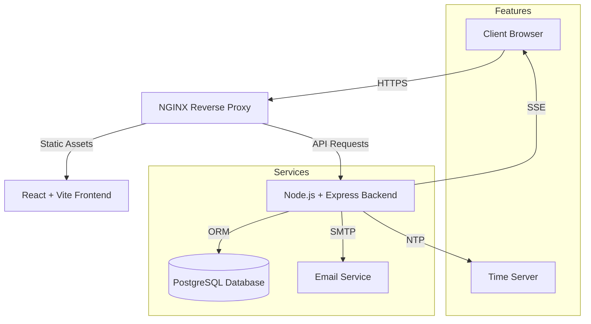

<p align="center">
  
</p>

<h1 align="center">🍽️ Enterprise Catering Management System</h1>

<p align="center">
  <strong>A Scalable, Secure, and Modern Solution for Corporate Food Service Operations</strong>
</p>

<p align="center">
  
  
  
  <br />
  
  
  
  
</p>

---

## 📋 Executive Summary

The **Catering Management System** is an enterprise-grade platform designed to streamline corporate catering operations. It bridges the gap between employees, administration, and canteen operators through a unified, real-time interface. Built with scalability and data integrity in mind, it automates scheduling, minimizes food waste through rigid cutoff policies, and ensures seamless accountability.

Recently upgraded to **Version 2.0**, the system now includes advanced guest management, bulk ordering capabilities, and an automated email notification engine.

---

## ✨ Key Enterprise Features

### 🏢 Core Operations
| Feature | Functionality |
|---------|-------------|
| **Advanced Order Management** | **New:** Bulk ordering capability permitting multi-day meal planning in a single action. |
| **Intelligent Shift Support** | Flexible configuration coverage for multiple shifts (Morning, Afternoon, Night) with dynamic cutoff times. |
| **Visual Identity Check-in** | **New:** Enhanced security at food collection points with user photo verification on QR scan. |
| **Guest Registry** | **New:** Dedicated module for managing external guests, generating temporary access QR codes, and tracking visits. |

### 🛠 Administrative Control
| Feature | Functionality |
|---------|-------------|
| **Role-Based Access Control (RBAC)** | Granular permissions for **Admin**, **Canteen Operator**, and **User** roles. |
| **Email Communication Hub** | **New:** Built-in email push service with customizable HTML templates for invitations and notifications. |
| **Automated Policy Enforcement** | Auto-blacklist system for simple "No-Show" tracking to reduce wastage and enforce accountability. |
| **Audit & Governance** | comprehensive audit logging of all system actions and NTP-synced timekeeping for dispute resolution. |

### 📊 Reporting & Analytics
- **Excel Data Export**: Seamless export of transaction logs and user data for payroll integration.
- **Real-time Dashboard**: Live monitoring of daily orders, collection rates, and user activity.

---

## 🏗️ Technical Architecture

The solution uses a microservices-ready architecture, fully containerized for easy deployment.



---

## 🚀 Rapid Deployment

### Infrastructure Prerequisites
- **Docker** & **Docker Compose**
- **Git**

### 🐳 Enterprise Docker Setup (Recommended)

1. **Clone the Repository**
   ```bash
   git clone https://github.com/torpedoliar/Catering-Management-System.git
   cd Catering-Management-System
   ```

2. **Environment Configuration**
   Copy the example environment files and configure your credentials.
   ```bash
   cp backend/.env.example backend/.env
   cp frontend/.env.example frontend/.env
   ```

3. **Launch Services**
   Execute the full stack suite (Database, Backend, Frontend, Nginx).
   ```bash
   docker-compose up -d --build
   ```

4. **Verify Deployment**
   - **Frontend Application**: `http://localhost:3011`
   - **Backend Health Check**: `http://localhost:3012/health`

---

## 🔐 Security & Access

The system implements a tiered security model.

### Roles & Capabilities
| Role | Capabilities |
|------|-------------|
| **Administrator** | System-wide configuration, User Management, Guest Registry, Master Reporting, Security Policies. |
| **Canteen Operator** | QR/Manual Redemption, Real-time queue view, Visual verification of personnel. |
| **Standard User** | Self-service ordering, History view, Profile management. |

### Default Administrative Access
> [!IMPORTANT]
> Change these credentials immediately after the initial deployment.

- **Username**: `admin`
- **Password**: `admin123`

---

## 🛠️ Technology Standards

**Backend Layer**
- **Core**: Node.js, Express.js (TypeScript)
- **Data**: PostgreSQL, Prisma ORM
- **Security**: JWT Authentication, Rate Limiting, Helmet
- **Services**: Nodemailer, Server-Sent Events (SSE)

**Frontend Layer**
- **Core**: React 18, Vite
- **UI/UX**: Tailwind CSS, Headless UI, Framer Motion
- **State**: React Context API
- **Utilities**: XLSX (Excel Export), React-QR-Code

**DevOps & Infrastructure**
- **Containerization**: Docker, Docker Compose
- **Proxy**: NGINX
- **CI/CD**: Standard Git Flow

---

## 🤝 Contribution Guidelines

We welcome contributions to improve this enterprise solution.

1. **Fork** the repository.
2. Create a **Feature Branch** (`git checkout -b feature/StrategicEnhancement`).
3. **Commit** your changes (`git commit -m 'feat: Add strategic enhancement'`).
4. **Push** to the branch (`git push origin feature/StrategicEnhancement`).
5. Open a **Pull Request**.

---

<p align="center">
  <small>© 2026 Catering Management System. All Rights Reserved.</small>
  <br>
  <small>Maintained by <strong>Yohanes Octavian Rizky</strong></small>
</p>
